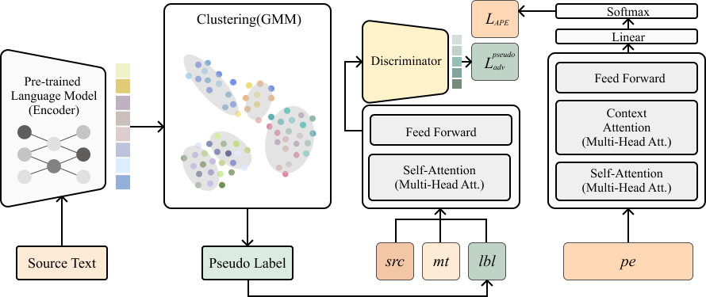
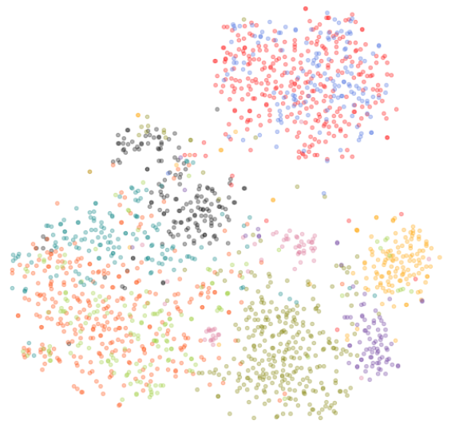
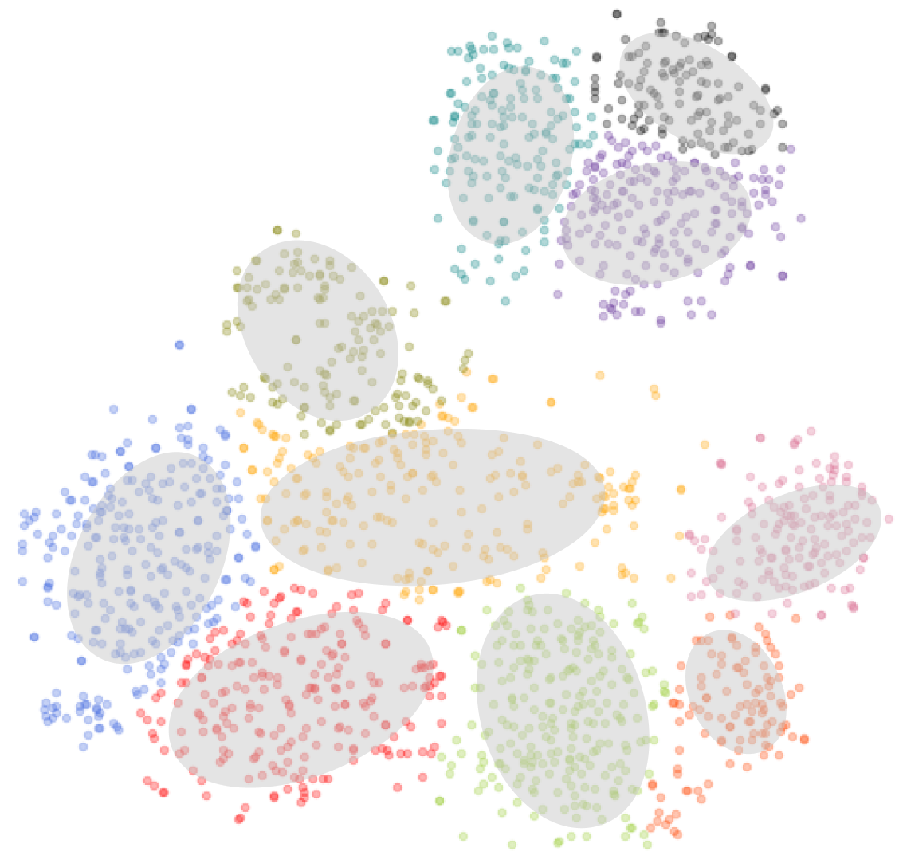

# PePAL: Personalized Post-editing via Adversarial Learning using Cluster Label



We propose PePAL, a simple yet effective model that utilizes cluster labels obtained from a pre-trained language model in an adversarial manner.

## Requirements
Currently, our implementation for PePAL is based on [OpenNMT-APE](https://github.com/deep-spin/OpenNMT-APE). The requirements are as follows:
- Python 3
- NumPy
- PyTorch (version>=1.0)
- sacreBLEU (https://github.com/mjpost/sacrebleu)
- six
- tqdm==4.30.*
- torchtext
- future
- configargparse

## Creating pusedo-labels using *create_pusedo-labels.ipynb*
<p align="center">
  
  
</p>

## Preprocess
Join mt and pe tokenized files
```
pr -tmJ -S" [SEP] " train.src.tok train.mt.tok > train.srcmt.tok
pr -tmJ -S" [SEP] " valid.src.tok valid.mt.tok > valid.srcmt.tok
pr -tmJ -S" [SEP] " test.src.tok test.mt.tok > test.srcmt.tok
```
Preprocess for OpenNMT-APE
```
python preprocess.py -config preprocessing.yml
```

```
train_src PATH/train.srcmt.tok
train_tgt: PATH/train.pe.tok
train_uid: PATH/train.USER
train_dom: PATH/train.10

valid_src: PATH/valid.srcmt.tok
valid_tgt: PATH/valid.pe.tok
valid_uid: PATH/valid.USER
valid_dom: PATH/valid.10

save_data: PATH/10-d10-data

src_vocab_size: 200000
tgt_vocab_size: 200000

shard_size: 100000

bert_src: bert-base-multilingual-cased
bert_tgt: bert-base-multilingual-cased

src_seq_length: 300
tgt_seq_length: 200

domain: True
```

## Train
```
python train.py -config ./config/domain_adv_with_ape-config-bert.yml
```

```
save_model: 'SAVE_FOR_MODEL'
log_file: 'PATH_FOR_LOG'
data: 'PATH_FOR_DATA'
pretrain_from: 'APE_PRETRAINED_MODEL'

# Domain
user_len: 30
domain_cls_enc: False
domain_adv: True
domain_classify: True
dom_cls: True
domain_ratio: 0.3
domain_len: 10
beam_size: 3

train_steps: 50000
start_decay_steps: 50000
valid_steps: 2000
save_checkpoint_steps: 2000
keep_checkpoint: 30

# Dimensionality
rnn_size: 768 #!
word_vec_size: 768 #!
transformer_ff: 3072 #!
heads: 12 #!
layers: 12 #!

# Embeddings
position_encoding: 'true' #!
share_embeddings: 'true' #!
share_decoder_embeddings: 'true' #!

# Encoder
encoder_type: bert #!
enc_bert_type: bert-base-multilingual-cased #!

# Decoder
decoder_type: bert #!
dec_bert_type: bert-base-multilingual-cased #!
bert_decoder_token_type: B #!

# Layer Sharing
bert_decoder_init_context: 'true'
share_self_attn: 'false'
# tie_context_attn: 'true'
# share_feed_forward: 'true'

# Regularization
dropout: 0.1
label_smoothing: 0.1

# Optimization
optim: bertadam #!
learning_rate: 0.00005
warmup_steps: 5000
batch_type: tokens
normalization: tokens
accum_count: 2
batch_size: 512
max_grad_norm: 0
param_init: 0
param_init_glorot: 'true'
valid_batch_size: 64

average_decay: 0.0001

# GPU
seed: 42
world_size: 1
gpu_ranks: 0
```
## Test
```
./translate.sh
```

```
MODEL=# MODEL_WEIGHT_PATH
DATA=# TEST_DATA_PATH
SAVE=# WHERE_TO_SAVE
PRED_SUFFIX=# NAME_FOR_SAVING_DATA
BATCH_SIZE=32
DATA_TYPE=test

# Although we don't use pusedo-labels and user information during inference time, 
# we need these configs (e.g., uid, dom, and dom_cls) for code simplification.

python translate.py -model ${MODEL} -src ${DATA}test.srcmt.tok -uid ${DATA}test.USER -dom ${DATA}test.10  -output ${SAVE}${DATA_TYPE}.${PRED_SUFFIX}.unprocessed  -beam_size 5 -min_length 1 -batch_size ${BATCH_SIZE} -report_time -length_penalty wu -gpu 0 -block_ngram_repeat 22 -max_length 76 -dom_cls

cat ${SAVE}${DATA_TYPE}.${PRED_SUFFIX}.unprocessed | sed 's/ \#\#//g' > ${SAVE}${DATA_TYPE}.${PRED_SUFFIX}
cat ${SAVE}${DATA_TYPE}.${PRED_SUFFIX} | sacrebleu ${DATA}test.pe.tok
cat ${SAVE}${DATA_TYPE}.${PRED_SUFFIX} | sacrebleu ${DATA}test.pe.tok --m ter
```
